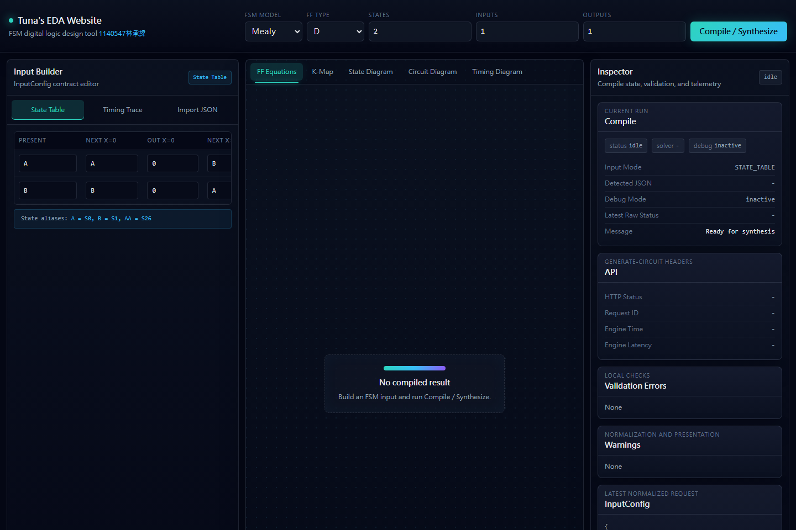
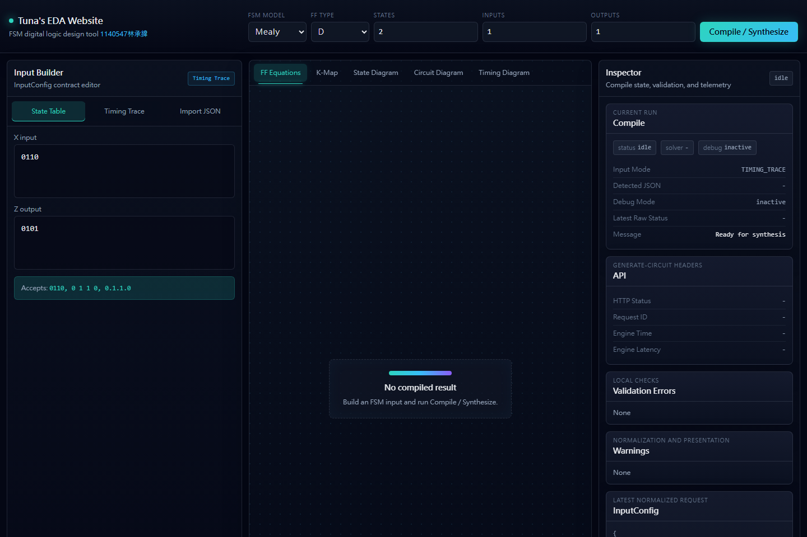
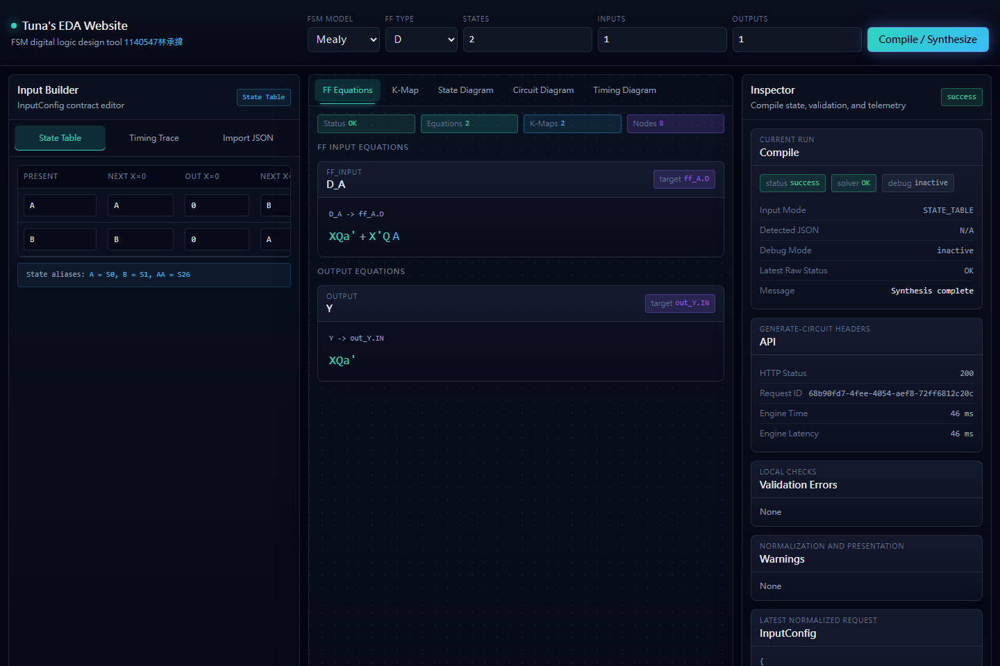
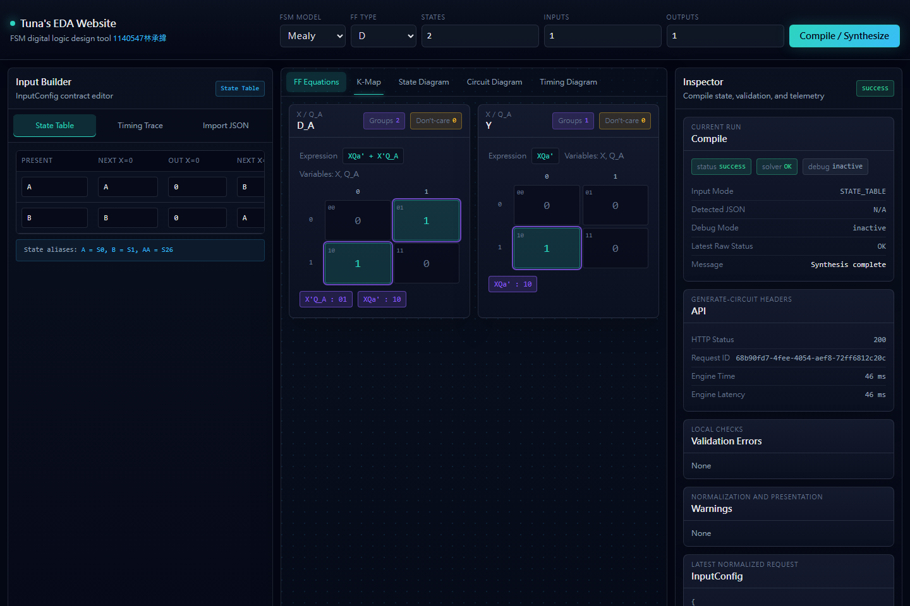
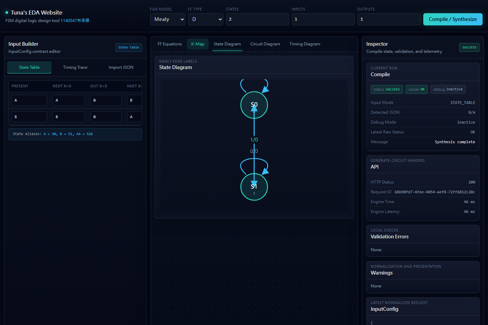
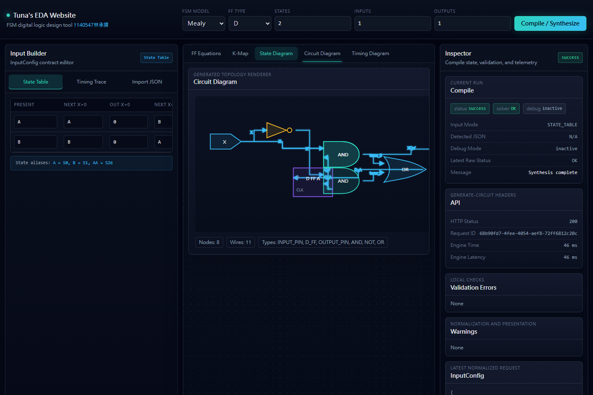
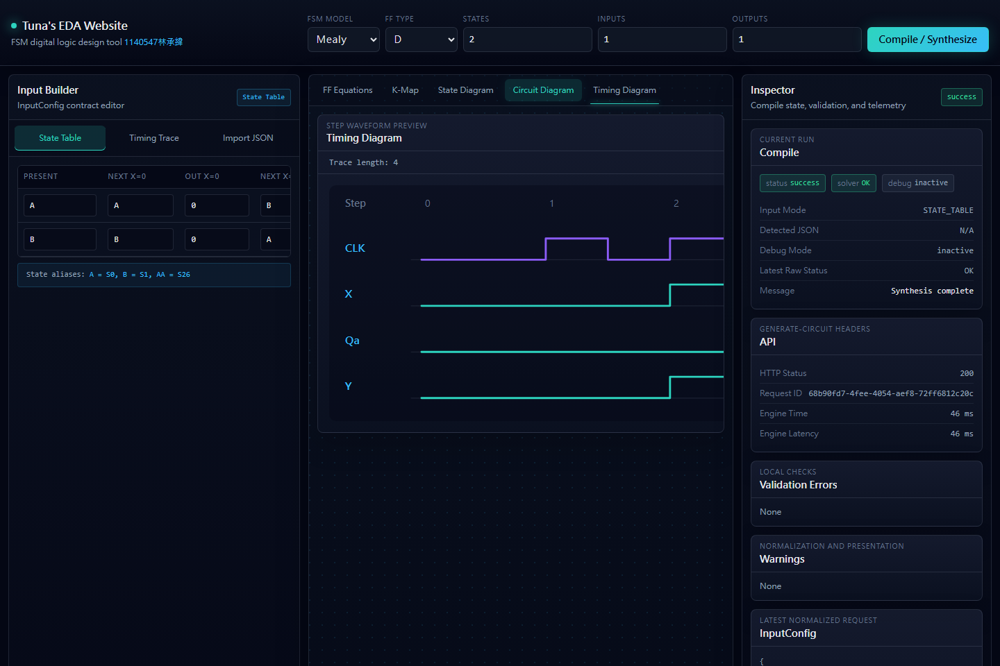
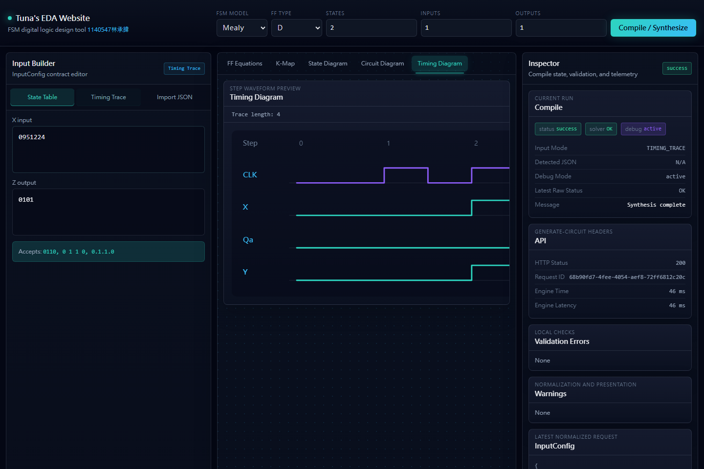
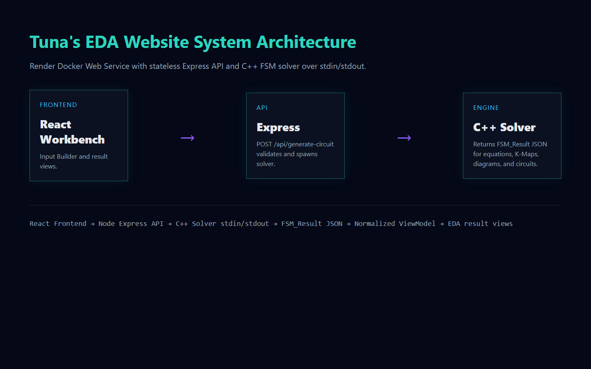

# 1140506 EDA

FSM digital logic design tool 1140506林稚婷

1140506 EDA is a Light EDA Workbench for building and inspecting finite-state-machine digital logic. It keeps the first screen as the actual tool: users enter a State Table, Timing Trace, or JSON payload, then synthesize solver output into equations, K-Maps, state diagrams, circuit diagrams, timing diagrams, and debug data.

Live Demo: pending deployment

GitHub: pending repository URL

## Screenshots












## Features

- State Table input for Mealy and Moore FSMs.
- Timing Trace input with deterministic baseline inference.
- Import JSON for InputConfig or FSM_Result payloads.
- D / T / JK / SR Flip-Flop excitation.
- FF Equations, K-Map, State Diagram, Circuit Diagram, and Timing Diagram result views.
- Debug Panel with raw InputConfig JSON, raw FSM_Result JSON, normalized ViewModel JSON, API metrics, and Timing Trace inference report.
- Raw solver JSON preserves complement notation as `#`; UI display helpers render complements as apostrophes.

## Tech Stack

- React
- Vite
- Tailwind CSS
- Konva / react-konva
- Node.js Express
- C++ solver executable over stdin/stdout
- Docker
- Render Docker Web Service

## Architecture

```txt
React Frontend
  -> POST /api/generate-circuit
Node Express API
  -> C++ solver stdin/stdout
C++ FSM Solver
  -> FSM_Result.json
Frontend ViewModel
  -> Equations / K-Map / State Diagram / Circuit Diagram / Timing Diagram
```

The backend remains stateless. No database is used. Production does not fallback to a mock solver.

## Input Modes

- `STATE_TABLE`: explicit transitions for 1-input / 1-output Mealy or Moore FSMs.
- `TIMING_TRACE`: X/Z trace input, inferred through the Phase 4A/4B deterministic baseline strategy.
- `IMPORT_JSON`: accepts either an InputConfig to compile through the API, or an FSM_Result to normalize locally without calling the API.

Timing Trace UI intentionally exposes only `X input` and `Z output`; it does not expose a user-editable CLK field.

## Output Views

- FF Equations: grouped FF input and output equations.
- K-Map: cells, groups, expression, variables, and don't-care count.
- State Diagram: FSM states and transitions, including inferred trace step metadata.
- Circuit Diagram: D_FF / T_FF / JK_FF / SR_FF symbols, gates, constants, and orthogonal wires.
- Timing Diagram: CLK, X, Q signals, and Y/Z output waveform rows.

All frontend result rendering goes through `normalizeFsmResult(raw)`.

## Local Development

```bash
npm install
npm run build:solver
npm run dev
```

In another terminal:

```bash
npm start
```

The Vite dev server proxies `/api` to `http://localhost:3001`.

## Build Commands

```bash
npm run build
npm run build:solver
```

Production builds use `build.sourcemap = false`; `npm run audit:dist` verifies that `dist/` contains no `.map` files.

## Test Commands

```bash
npm run test:solver -- --json
node server/test-state-aliases.cjs
npm run test:normalize
npm run test:input-config
npm run test:kmap
npm run test:circuit
node server/test-api-smoke.cjs --spawn-server
npm run test:browser
npm run audit:dist
npm run test:production
npm run verify:local
```

Current solver smoke summary:

- `npm run test:solver -- --json`: 95 checks, 0 failures

## Screenshots Command

```bash
npm run screenshots
```

This starts a local production server, captures the workbench and result views with Playwright, and writes PNG files under `docs/images/`.

## API Contract

- `GET /api/health` returns `{ "status": "OK" }`.
- `POST /api/generate-circuit` accepts a stateless FSM input config and invokes the C++ solver executable.
- Response headers include `X-Request-Id`, `X-Engine-Time-Ms`, and `X-Engine-Latency-Ms`.
- Solver raw JSON keeps complement notation as `#`, such as `Q_A#` and `Q_B#`.
- UI display helpers convert complement notation to apostrophe form, such as `Qa'` and `Qb'`.
- API routes are protected from frontend SPA fallback; unknown `/api/*` routes return API JSON errors.

## Production Local Test

```bash
npm run build
npm run build:solver
npm run test:production
```

`test:production` starts the Express app with `NODE_ENV=production`, serves `dist`, uses the compiled C++ solver, checks `/api/health`, verifies State Table and Timing Trace synthesis, checks frontend fallback routes, checks `/api/unknown`, and shuts the server down.

## Docker / Render Deployment

The project deploys as a Render Docker Web Service.

- Docker base image: `node:20-bookworm`
- Docker installs `g++`
- Docker build runs `npm ci`, `npm run build`, `npm run build:solver`, and `npm run test:solver -- --json`
- Production command: `npm start`
- Render health check path: `/api/health`
- Render env:
  - `NODE_ENV=production`
  - `FSM_SOLVER_PATH=engine/fsm_solver`
  - `VITE_API_BASE_URL=/api`

Render owns the runtime `PORT`; the project does not hardcode `PORT=3001` for production.

Deployment status:

- Live Demo is pending deployment until the Render URL is available.
- After deployment, update `Live Demo` near the top of this README with the real Render URL.
- Do not use the Windows `engine/fsm_solver.exe` as the Render solver.
- Render uses the Linux solver path `engine/fsm_solver`.

## Post-Deploy Verification

```bash
npm run test:deployed -- https://your-render-url.onrender.com
```

Or:

```bash
DEPLOY_URL=https://your-render-url.onrender.com npm run test:deployed
```

This test is not part of `verify:local` because it requires a public Render URL. Run it after Render deployment, then do a manual browser smoke for State Table compile, Timing Trace compile, result tabs, Debug trigger `0951224`, apostrophe complement display, and no CLK input in Timing Trace mode.

## Current Phase

- Phase 1A: full-stack scaffold completed
- Phase 1B: InputConfig / normalize / compile flow completed
- Phase 1C: browser smoke + solver contract fixtures completed
- Phase 2: EDA Workbench visual redesign completed
- Phase 3A: State Table D-FF real solver baseline completed
- Phase 3B: Boolean minimization + K-Map grouping completed
- Phase 3C: T Flip-Flop excitation completed
- Phase 3D: JK Flip-Flop excitation completed
- Phase 3E: SR Flip-Flop excitation completed
- Phase 4A: Timing Trace baseline inference completed
- Phase 4B: Timing Trace inference report + result view refinement completed
- Phase 5: Production hardening + deployment verification + README screenshots completed
- Phase 6B: Deployment handoff package + manual Render deploy checklist

## Current Solver Scope

Solver Phase 6B supports:

- `STATE_TABLE`
- `TIMING_TRACE` baseline inference
- Mealy / Moore
- D / T / JK / SR Flip-Flop
- 1 input
- 1 output
- up to 8 states
- Boolean minimization for 1-4 variables
- K-Map grouping with don't-care support
- SR illegal condition protection
- no 0-cell groups
- simplified-expression-based circuit topology
- D_FF / T_FF / JK_FF / SR_FF circuit nodes
- constant 0 / 1 driver nodes
- Timing Diagram generated from State Table or Timing Trace

## Known Limitations

- Multi-input FSMs are not yet supported.
- Multi-output FSMs are not yet supported.
- `state_count` is limited to 8.
- Timing Trace inference is a deterministic baseline, not guaranteed mathematically minimal FSM inference.
- Boolean minimization is Phase 3B K-Map grouping level, not an industrial-strength optimizer.
